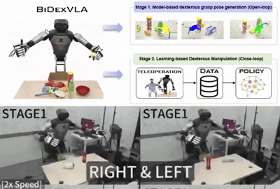
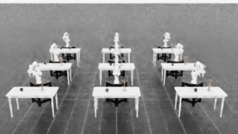

Hello! I'm Yixiang Jin, a passionate **researcher and engineer in the field of robotics**. I hold a Ph.D. in Robotics from the [University of Sheffield](https://www.sheffield.ac.uk/), where I was awarded the [RAIN](https://uomrobotics.com/collaborations/rain/) project scholarship. After I graduated with my Ph.D., I was postdoctoral research assistant at the [University of Bristol](https://www.bristol.ac.uk/)

I currently serve as a **Research Scientist** at [**JDT(京东科技)**](https://www.jdt.com.cn/), where I am responsible for the development and deployment of advanced bimanual manipulation systems. Prior to my role at JDT, I am a Robotics Scientist at [Samsung R&D Institute China - Beijing](https://research.samsung.com/src-b) from September 2022. Since 2025, I lead the R&D of [bimanual VLA for humanoid robots](https://sevenfo.github.io/BiDexVLA/) in SRC_B.

**Please find my [CV](https://alex0110-yx.github.io/cv/) and feel free to reach out if you’re interested in collaborating or discussing any topics related to robotics!**

## Recent Project

    <figure style="display: inline-block; width: 25%; margin: 0 3.5% 15px; text-align: center;">
        <a href="https://sevenfo.github.io/BiDexVLA/" target="_blank">
            
            <figcaption style="font-size: 12px; color: #555;">[Paper] BiDexVLA: A Hybrid Framework for Fast and Robust Bimanual Dexterous Grasping </figcaption>
        </a> 
    </figure>
    <figure style="display: inline-block; width: 30%; margin: 0 1.5% 15px; text-align: center;">
        
        <figcaption style="font-size: 12px; color: #555;">[DataGeneration] Large-Scale Robot Manipulation   Sythitic Data Generation</figcaption>
    </figure>
    <figure style="display: inline-block; width: 30%; margin: 0 1.5% 15px; text-align: center;">
        <a href="https://arxiv.org/pdf/2312.01421" target="_blank">
            
            <figcaption style="font-size: 12px; color: #555;">[Paper] RobotGPT: Robot Manipulation Learning  from ChatGPT</figcaption>
        </a>
    </figure>
    <figure style="display: inline-block; width: 30%; margin: 0 1.5% 15px; text-align: center;">
        <a href="https://alex0110-yx.github.io/projects/1_project/" target="_blank">
            
            <figcaption style="font-size: 12px; color: #555;">[Demo] Robotic Picking for the  New Retail Scenario </figcaption>
        </a>
    </figure>
    <figure style="display: inline-block; width: 30%; margin: 0 1.5% 15px; text-align: center;">
        <a href="https://arxiv.org/pdf/2409.08527" target="_blank">
            
            <figcaption style="font-size: 12px; color: #555;">[Paper]EHC-MM: Embodied Holistic Control for  Mobile Manipulation</figcaption>
        </a>
    </figure>
    <figure style="display: inline-block; width: 30%; margin: 0 1.5% 15px; text-align: center;">
        <a href="https://pku-epic.github.io/ASGrasp/" target="_blank">
            
            <figcaption style="font-size: 12px; color: #555;">[Paper] ASGrasp: Generalizable Transparent  Object Reconstruction and Grasping</figcaption>
        </a>
    </figure>

 